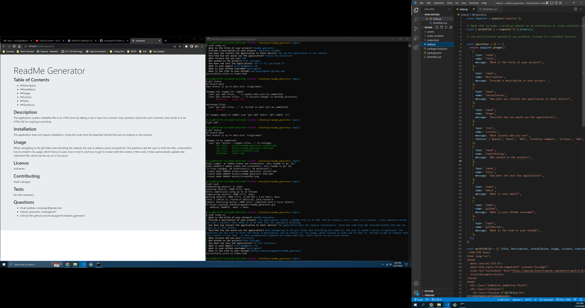

ReadMe Generator

Table of Contents
- [Description](#description)
- [Installation](#installation)
- [Usage](#usage)
- [Contributing](#Contributing)
- [Questions](#Questions)

## Description
The application creates a ReadMe file in an HTML form by taking a user's input in a console. Every question stores the user's answers, then sends it to an HTML file for copying or printing.

## Screenshot

## Installation
The application does not require installation. Clone the code from the attached GitHub link and run index.js in the console.

## Usage
When navigating to the git folder and activating the index.js, the user is asked a series of questions. The questions ask the user to write the title, a description, how to install it, its usage, which licence it used, how to test it, and how to get in contact with the creator of the code. It then automatically updates the index.html file, which can be run on a live server.

## Contributing
Mark Calcagno

## Questions
Email address: mcalcagn@gmail.com
GitHub username: mcalcagno47
GitHub link: github.com/mcalcagno47/readme_generator
YouTube links: 
1: https://www.youtube.com/watch?v=i8QSOcB3QUA&ab_channel=MarkCalcagno
2: https://www.youtube.com/shorts/hhnbzBsflZo
